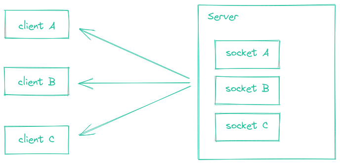
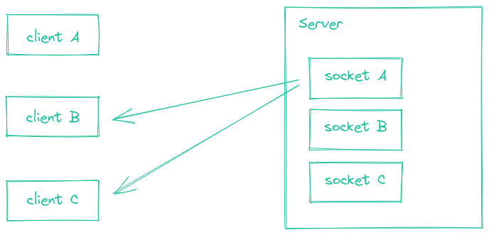
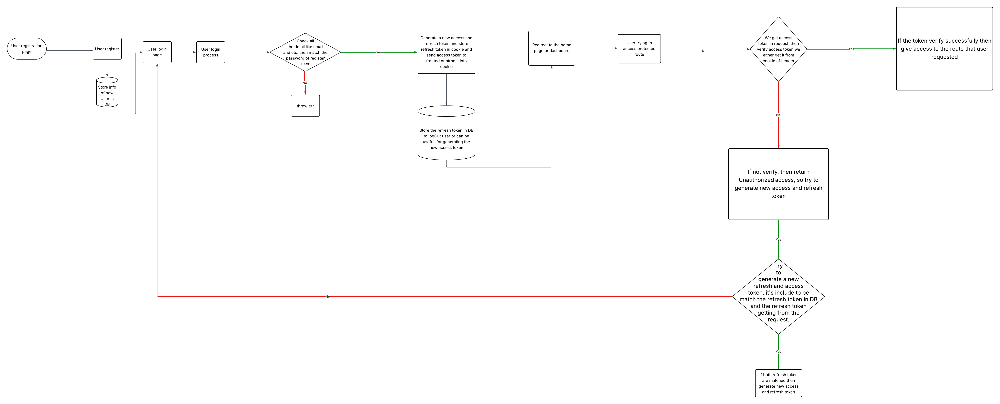

# 🕸️ Understanding of WebRTC

WebRTC (Web Real-Time Communication) is a technology that enables peer-to-peer communication between web browsers and mobile applications. It allows audio, video, and data sharing without the need for an intermediary server.

WebRTC serves multiple purposes; together with the Media Capture and Streams API, they provide powerful multimedia capabilities to the Web, including support for audio and video conferencing, file exchange, screen sharing, identity management, and interfacing with legacy telephone systems including support for sending DTMF (touch-tone dialing) signals. Connections between peers can be made without requiring any special drivers or plug-ins, and can often be made without any intermediary servers.

---

# 🌊 Introduction to WebRTC Protocols

---

## ❄️ ICE (Interactive Connectivity Establishment)

Interactive Connectivity Establishment (ICE) is a framework to allow your web browser to connect with peers. There are many reasons why a straight up connection from Peer A to Peer B won't work. It needs to bypass firewalls that would prevent opening connections, give you a unique address if like most situations your device doesn't have a public IP address, and relay data through a server if your router doesn't allow you to directly connect with peers. ICE uses STUN and/or TURN servers to accomplish this.

---

## 🧊 STUN (Session Traversal Utilities for NAT)

Session Traversal Utilities for NAT (STUN) is a protocol to discover your public address and determine any restrictions in your router that would prevent a direct connection with a peer.

The client will send a request to a STUN server on the Internet who will reply with the client's public address and whether or not the client is accessible behind the router's NAT.


Here peer A is behind a NAT and wants to connect to peer B. Peer A sends a request to the STUN server, which replies with peer A's public address. Same way peer B sends a request to the STUN server, which replies with peer B's public address. Now both peers can connect to each other using their public addresses.

---

## 🌐 NAT (Network Address Translation)

Network Address Translation (NAT) is used to give your device a public IP address. A router will have a public IP address and every device connected to the router will have a private IP address. Requests will be translated from the device's private IP to the router's public IP with a unique port. That way you don't need a unique public IP for each device but can still be discovered on the Internet.

Some routers will have restrictions on who can connect to devices on the network. This can mean that even though we have the public IP address found by the STUN server, not anyone can create a connection. In this situation we need to use `TURN`.

---

## 🔁 TURN (Traversal Using Relays around NAT)

Some routers using NAT employ a restriction called 'Symmetric NAT'. This means the router will only accept connections from peers you've previously connected to.

Traversal Using Relays around NAT (TURN) is meant to bypass the Symmetric NAT restriction by opening a connection with a TURN server and relaying all information through that server. You would create a connection with a TURN server and tell all peers to send packets to the server which will then be forwarded to you. This obviously comes with some overhead so it is only used if there are no other alternatives.


Here peer A is behind a Symmetric NAT and wants to connect to peer B. Peer A sends a request to the TURN server, which replies with peer A's public address. Same way peer B sends a request to the TURN server, which replies with peer B's public address. Now both peers can connect to each other using their public addresses through the TURN server.

---

## 📝 SDP (Session Description Protocol)

Session Description Protocol (SDP) is a standard for describing the multimedia content of the connection such as resolution, formats, codecs, encryption, etc. so that both peers can understand each other once the data is transferring. This is, in essence, the metadata describing the content and not the media content itself.

Technically, then, SDP is not truly a protocol, but a data format used to describe connection that shares media between devices.

**How SDP is used in WebRTC:**

- When two peers want to establish a WebRTC connection, they exchange SDP messages as part of the offer/answer model.
- The "offer" contains information about the media formats and connection parameters supported by the initiating peer.
- The "answer" contains the supported formats and parameters from the responding peer.
- This negotiation ensures both peers agree on how to send and receive media.

**What SDP describes:**

- Media types (audio, video, data)
- Supported codecs (e.g., VP8, H.264 for video; Opus for audio)
- Network information (IP addresses, ports)
- Encryption methods and keys
- Bandwidth requirements

**Example SDP snippet:**

```bash
v=0
o=- 46117317 2 IN IP4 127.0.0.1
s=-
t=0 0
m=audio 49170 RTP/AVP 0
a=rtpmap:0 PCMU/8000
```

**Summary:**  
SDP is essential for negotiating and establishing compatible media streams between peers in WebRTC, but it does not carry the media itself—only the description of how it will be exchanged.

---

## 🔒 DTLS (Datagram Transport Layer Security)

✅ **What it is:**

- DTLS is the UDP-compatible version of TLS (used in HTTPS).
- It provides encryption, authentication, and integrity for data sent over UDP (which WebRTC uses).

📦 **Why DTLS in WebRTC?**

- WebRTC uses UDP for faster, low-latency communication.
- DTLS ensures that even though it's UDP, the communication is still secure and encrypted.
- It's used to negotiate encryption keys for media channels (which are then passed to SRTP).

---

## 🎧 SRTP (Secure Real-time Transport Protocol)

✅ **What it is:**

- SRTP is a secure version of RTP (Real-time Transport Protocol).
- It's used for encrypting and authenticating audio/video media streams.

🛡 **What SRTP Does:**

- Encrypts audio and video so that attackers can't listen in.
- Authenticates packets so that no one can inject or tamper with media.
- Lightweight and designed for real-time communication (low latency).

---

## 🔁 How DTLS and SRTP Work Together in WebRTC

🔐 **DTLS-SRTP Flow:**

1. DTLS handshake happens between peers over UDP.
2. This is like "securely shaking hands" to agree on encryption keys.
3. These keys are then used to encrypt and decrypt media using SRTP.
4. Audio/video is transmitted over SRTP, which is fast and secure.

📌 **Real-World Analogy:**

- `DTLS` is like a secure handshake between two people to agree on a secret code.
- `SRTP` is like using that secret code to talk so no one else understands.

---

## 🎥 RTP (Real-time Transport Protocol)

- The Real-time Transport Protocol (RTP), defined in RFC 3550, is an `IETF`(Internet Engineering Task Force) standard protocol to enable real-time connectivity for exchanging data that needs real-time priority.

- ℹ️ Note: WebRTC actually uses SRTP (Secure Real-time Transport Protocol) to ensure that the exchanged data is secure and authenticated as appropriate.

### `Capabilities` of RTP

- RTP's primary benefits in terms of WebRTC include:

  - Generally low latency.

  - Packets are sequence-numbered and timestamped for reassembly if they arrive out of order. This lets data sent using RTP be delivered on transports that don't guarantee ordering or even guarantee delivery at all.

  - This means RTP can be — but is not required to be — used atop UDP for its performance as well as its multiplexing and checksum features.

  - RTP supports multicast; while this isn't yet important for WebRTC, it's likely to matter in the future, when WebRTC is (hopefully) enhanced to support multi-user conversations.

  - RTP isn't limited to use in audiovisual communication. It can be used for any form of continuous or active data transfer, including data streaming, active badges or status display updates, or control and measurement information transport.

### Things RTP `doesn't` do

- RTP itself doesn't provide every possible feature, which is why other protocols are also used by WebRTC. Some of the more noteworthy things RTP doesn't include:

  - RTP does not guarantee `quality-of-service` (QoS).

  - While RTP is intended for use in latency-critical scenarios, it doesn't inherently offer any features that ensure QoS. Instead, it only offers the information necessary to allow QoS to be implemented elsewhere in the stack.

  - RTP doesn't handle allocation or reservation of resources that may be needed.

- Where it matters for WebRTC purposes, these are dealt with in a variety of places within the WebRTC infrastructure. For example, `RTCP`(Real-Time Transport Control Protocol) handles QoS monitoring.

### 📌 RTP is paired with RTCP (RTP Control Protocol) to provide

- Feedback about network quality (jitter, delay, packet loss)

- Synchronization between audio and video streams

---

## ⚡ WebRTC Stages

WebRTC works in these stages:

1. 📨 **Signalling**
2. 🔗 **Connecting**
3. 🔒 **Securing**
4. 📡 **Communicating**

- For example, if two clients want to communicate with each other, they need to exchange some information about themselves. This is done through a signalling server. The signalling server is not part of the WebRTC protocol, but it is used to exchange the information needed to establish a connection between the two clients.
- The signalling server can be any server that can exchange messages between the two clients. It can be a WebSocket server, a REST API, or any other server that can exchange messages.
- Once the two clients have exchanged the information needed to establish a connection, they can connect to each other using the WebRTC protocol (ICE-Interactive Connectivity Establishment). This is done by creating a peer connection between the two clients.
- Once the peer connection is established, the two clients can exchange media (audio, video, data) using the WebRTC protocol. The media is encrypted using DTLS (Datagram Transport Layer Security) and SRTP (Secure Real-time Transport Protocol) to ensure that the media is secure.
- Then they communicate using RTP and SCTP (Real-time Transport Protocol and Stream Control Transmission Protocol) to exchange media (audio, video, data) between the two clients.
- The WebRTC protocol is designed to work in real-time, which means that the media is exchanged in real-time between the two clients. This allows for low latency communication between the two clients.

---

# Socket.io And WebSocket

## 1. 🧪 HTTP Long-Polling (Fallback Transport)

📌 What is it?
HTTP long-polling is a technique where the client sends a request and waits (keeps the connection open) until the server has new data. Once the server responds, the client immediately sends another request.

⚙️ How it works:

- Client makes an HTTP request.

- Server holds the request open until it has data to send.

- Once data is sent, client immediately makes another request.

- Repeats in a loop.

✅ Pros:

- Works on all browsers and networks.

- Acts as a fallback when WebSocket/WebTransport is not supported.

❌ Cons:

- Higher latency than WebSocket.

- More overhead (due to repeated HTTP requests).

### 2. ⚡ WebSocket (Default & Preferred Transport)

📌 What is it?
WebSocket is a full-duplex, persistent connection over a single TCP connection. Once established, it allows real-time, two-way communication without the overhead of HTTP.

⚙️ How it works:

- Starts with an HTTP handshake.

- Then upgrades the connection to WebSocket.

- After that, data flows freely in both directions.

✅ Pros:

- Very low latency.

- Efficient for real-time apps (like chat, games).

- Widely supported in modern browsers.

❌ Cons:

- Blocked on some corporate firewalls.

- Can be fragile in unreliable networks.

## 🌐 how WebSocket works — step-by-step

### 🔌 What is WebSocket?

- WebSocket is a full-duplex, persistent communication protocol that allows data to be sent both ways (client ↔ server) over a single connection.

- Unlike HTTP, which is request-response based, WebSocket stays open — allowing real-time communication (e.g., chat apps, games, live dashboards).

### 🔄 Lifecycle of a WebSocket Connection

#### 1. 📞 Handshake (Upgrade Request)

- The client initiates a standard HTTP request to the server.

- But it includes a special header:

  ```makeFile
  Upgrade: websocket
  Connection: Upgrade
  ```

- If the server supports WebSocket, it responds with a 101 Switching Protocols status and upgrades the connection.

✅ At this point, the protocol switches from HTTP → WebSocket.

#### 🔧 Example

- Client Request:

  ```http
  GET /chat HTTP/1.1
  Host: example.com
  Upgrade: websocket
  Connection: Upgrade
  Sec-WebSocket-Key: dGhlIHNhbXBsZSBub25jZQ==
  ```

- Server Response:

  ```http
  HTTP/1.1 101 Switching Protocols
  Upgrade: websocket
  Connection: Upgrade
  Sec-WebSocket-Accept: s3pPLMBiTxaQ9kYGzzhZRbK+xOo=
  ```

#### 2. 🌐 Persistent Connection Established

- Now, both client and server can send messages freely at any time.

- No more HTTP headers. Just raw WebSocket frames.

- It stays alive until one side closes it or the connection breaks.

#### 3. 📡 Message Exchange

- Messages are exchanged as frames.

- A frame is a small packet that contains the message payload + metadata (like opcode, length, mask, etc.).

- 📤 Client sends:

  ```js
  socket.send("Hello Server!");
  ```

- 📥 Server responds:

  ```js
  socket.send("Hello Client!");
  ```

- This can happen hundreds of times per second without reopening connections.
---

## How it works

### The Socket.IO codebase is split into two distinct layers

1. the low-level plumbing: what we call Engine.IO, the engine inside Socket.IO
2. the high-level API: Socket.IO itself

### Engine.IO

- Engine.IO is responsible for establishing the low-level connection between the server and the client. It handles:

- the various transports and the upgrade mechanism
the disconnection detection

### HTTP long-polling

- The HTTP long-polling transport (also simply referred as "polling") consists of successive HTTP requests:

- long-running GET requests, for receiving data from the server
- short-running POST requests, for sending data to the server

Due to the nature of the transport, successive emits may be concatenated and sent within the same HTTP request.

## Handshake

- At the beginning of the Engine.IO connection, the server sends some information:

  ```json
    {
    "sid": "FSDjX-WRwSA4zTZMALqx",
    "upgrades": ["websocket"],
    "pingInterval": 25000,
    "pingTimeout": 20000
    }
  ```

- the sid is the ID of the session, it must be included in the sid query parameter in all subsequent HTTP requests
- the upgrades array contains the list of all "better" transports that are supported by the server
- the pingInterval and pingTimeout values are used in the heartbeat mechanism

---

### 🧭 PING && PONG

- PING = "Are you still there?"

- PONG = "Yes, I’m here."

- They help detect:

- dead connections,

- broken links,

- dropped clients (especially on mobile networks or behind proxies).

### 🧩 How It Works

📤 Server sends: PING

- Periodically, the server sends a small frame with the PING opcode to the client.

📥 Client replies: PONG

- The client automatically replies with a PONG frame.

🔁 This exchange confirms the connection is alive.

 ❌  If no PONG is received within a timeout → connection is closed.

- Sometimes, abnormal ping-pong behavior can be used to detect bots, proxies, or DDoS attacks that open but don't maintain connections properly.

### 🧪 Example in Socket.IO

Socket.IO has built-in heartbeat mechanism using ping-pong:

```javascript
const io = require("socket.io")(3000, {
  pingInterval: 25000, // send ping every 25s
  pingTimeout: 5000     // wait max 5s for pong
});


```

---

## Server Initialization

- e.g with Express:-

  ```javascript
  import express from "express";
  import { createServer } from "http";
  import { Server } from "socket.io";

  const app = express();
  const httpServer = createServer(app);
  const io = new Server(httpServer, { /* options */ });

  io.on("connection", (socket) => {
    // ...
  });

  httpServer.listen(3000);
  ```

Using `app.listen(3000)` will not work here, as it creates a new HTTP server.

- Emit custom events (socket.emit)
- Listen from events (socket.on)
- Exchange any data (text, JSON, binary)

---

## 🌍 Broadcasting events

- Socket.IO makes it easy to send events to all the connected clients.

- Please note that broadcasting is a server-only feature.


### To all connected clients

  

  ```javascript
  io.emit("hello", "world");
  ```

### To all connected clients except the sender

  

  ```javascript
  io.on("connection", (socket) => {
    socket.broadcast.emit("hello", "world");
  });
  ```

- In the example above, using socket.emit("hello", "world") (without `broadcast` flag) would send the event to "client A". 

---
## 🚻 Rooms

- A room is an arbitrary channel that sockets can join and leave. It can be used to broadcast events to a subset of clients:

### 🏠 What is a Room in Socket.IO?

- A room is a named channel (a string name) that you can assign clients (sockets) to.

<b> Think of it like: </b>

- A private group chat — only users in that room can hear what’s being said.

- 🧠 It's not a real object — it’s just a label used by the server to group sockets together.

### 🧭 Why Use Rooms?

- Rooms allow you to:

    - Group sockets dynamically (e.g., per chat room, game room, team)

    - Broadcast messages only to sockets in that group

    - Avoid sending data to every connected client

- join room: `socket.join("roomName")`
- Leave room: `socket.leave("roomName")`
- Emit to room: `io.to("roomName").emit()`
- Exclude a room: `io.except("some room").emit("some event")`
- Emit to several rooms at the same time: `io.to("room1").to("room2").to("room3").emit("some event");`

- We can also broadcast to a room from a given socket:

  ```javascript
  io.on("connection", (socket) => {
    socket.to("some room").emit("some event");
  });
  ```

- In this case, every socket in the room excluding the sender will get the event.


---

### 🧑‍🤝‍🧑 FlowChart of user Authentication and Authorization



---
